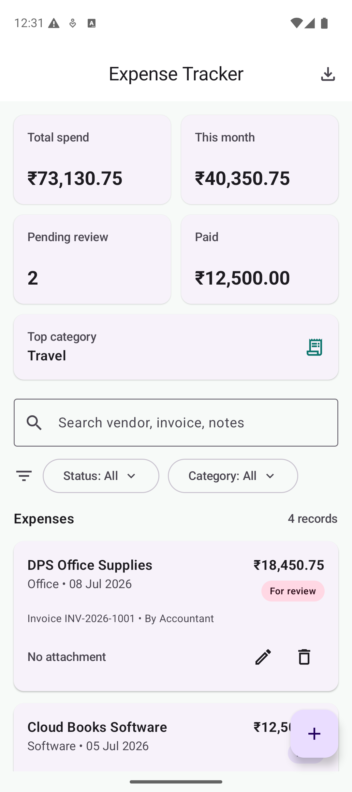
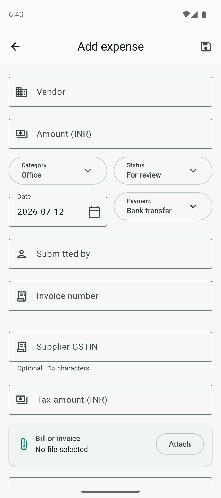
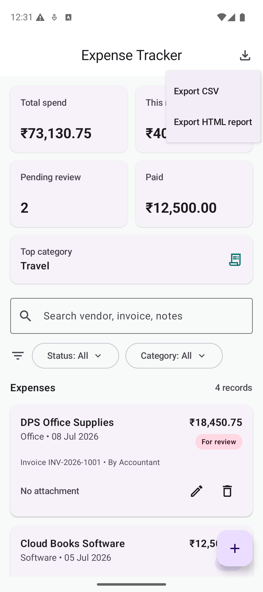
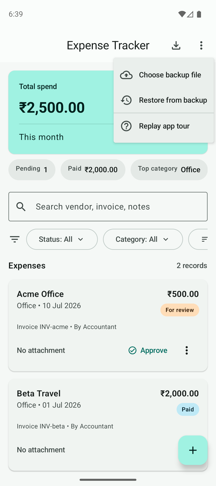
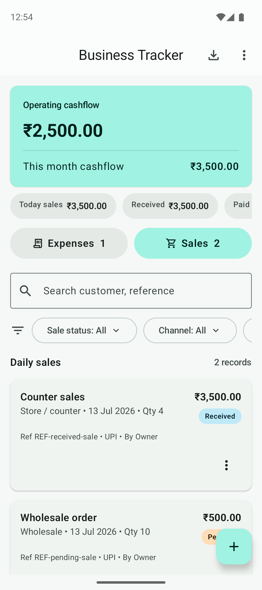
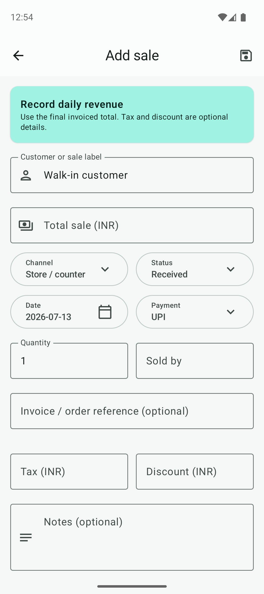

# Business Expense & Sales Tracker

[](LICENSE)
[](https://developer.android.com/about/versions/10)

**[Download the latest Android APK](https://github.com/Tolstoyj/BusinessExpTracker/releases/latest)**

Business Expense & Sales Tracker is a free, open-source, local-first Android application for tracking business spending, daily revenue, payment collection, operating cashflow, backups, and reports. It is designed for an owner, CFO, accountant, or finance operator who needs a practical business register without uploading financial data to an application backend.

## Screenshots

| Dashboard | Add Expense |
| --- | --- |
|  |  |
| Export Reports | Backup And Restore |
|  |  |
| Sales Ledger | Add Daily Sale |
|  |  |

## Features

- Learn the app with a first-launch guided tour that spotlights the dashboard, add button, search, export, and backup; replay it anytime from the ⋮ menu.
- Add, edit, and delete business expense records.
- Add, edit, duplicate, filter, and delete daily sales records.
- Track customer or sale label, final sale total, channel, payment method, collection status, salesperson, quantity, reference, tax, discount, and notes.
- Move sales between Pending, Received, and Refunded states with quick actions.
- View operating cashflow based on received sales minus paid expenses, plus today/month sales and pending collections.
- Scan an invoice with the camera or import an existing image to prefill expense details.
- Run bundled OCR and QR/barcode recognition on-device; scanned invoice data is not uploaded.
- Review extracted vendor, invoice number, date, total, GSTIN, and tax with confidence indicators before saving.
- Reuse the category, payment method, and submitter from previously confirmed expenses for the same vendor.
- Duplicate a previous expense to enter recurring or similar purchases faster.
- Track vendor, amount, tax, supplier GSTIN, date, category, payment method, submitted-by, invoice number, notes, and status.
- Attach a bill, receipt, or invoice file using Android's document picker.
- View dashboard analytics for total spend, current month spend, paid amount, pending review count, and top category.
- Search, filter, and sort by vendor, invoice, notes, category, status, date, or amount.
- Move draft, review, and approved expenses forward with quick status actions.
- Detect duplicate invoice numbers before saving and confirm before discarding unsaved changes.
- Choose dates with the native Android date picker.
- Display all money values in INR.
- Export the current filtered and sorted expense or sales ledger as CSV.
- Export either ledger as a browser-readable HTML report with its own summary.
- Use a custom adaptive launcher icon with Android themed-icon support.
- Work offline with local device persistence.
- Recover from a corrupted primary local-data snapshot using the previous valid snapshot.
- Create a portable `.betbackup.zip` archive containing every expense, every sale, and every readable expense attachment.
- Keep a user-selected backup file updated automatically after changes in either ledger.
- Restore a backup on the same or a different Android device, with a choice to merge records or replace local data.
- Restore older v1 expense-only backups without losing compatibility.

## Expense Statuses

- Draft
- For review
- Approved
- Paid
- Rejected

## Export Formats

The app supports two export formats:

- CSV: best for Excel, Google Sheets, accounting imports, and further analysis.
- HTML report: best for sharing a readable report with owners, auditors, or stakeholders who do not have the app installed.

The HTML export includes summary cards and a full expense table. The CSV export includes raw INR amounts and all key expense fields.

## Privacy

Expense and sales records, imported images, OCR processing, and barcode recognition stay on the device. The app has no account system, analytics SDK, advertising SDK, or application backend. Android may download the optional ML Kit Document Scanner module through Google Play services. Data leaves the app only when the user explicitly exports, shares, or saves a backup.

## Tech Stack

- Kotlin
- Jetpack Compose
- Material 3
- Android document picker
- SharedPreferences JSON persistence
- Gradle Kotlin DSL

## Requirements

- Android Studio with Android SDK installed
- JDK 11 or newer
- Android SDK 36.1, matching the current project configuration
- A device or emulator running Android 10 or newer

## Build

From the project root:

```bash
./gradlew :app:assembleDebug
```

The debug APK is generated at:

```text
app/build/outputs/apk/debug/app-debug.apk
```

## Test And Lint

```bash
./gradlew :app:testDebugUnitTest :app:lintDebug
```

With an emulator or device connected, run the end-to-end user journeys:

```bash
./gradlew :app:connectedDebugAndroidTest
```

Full verification command:

```bash
./gradlew :app:assembleDebug :app:testDebugUnitTest :app:connectedDebugAndroidTest :app:lintDebug
```

## Project Structure

```text
app/src/main/java/com/dps/businessexpensetracker/
  MainActivity.kt                 # Compose UI and Android file picker/export wiring
  data/
    ExpenseModels.kt              # Expense model, draft model, enums, validation
    ExpenseRepository.kt          # Local persistence
    ExpenseExporter.kt            # CSV and HTML export generation
    ExpenseBackupManager.kt       # Portable ZIP backup, attachment copy, and restore validation
    InvoiceExtraction.kt          # On-device OCR/barcode processing and field extraction
    SalesModels.kt                # Sales ledger, statuses, channels, drafts, and validation
    SalesExporter.kt              # Sales CSV and HTML report generation
  ui/
    GuidedTour.kt                 # First-launch and replayable feature tour
  ui/theme/                       # Material theme

docs/
  requirements.md                 # Product requirements and assumptions
  screenshots/                    # README screenshots
```

## Current Data Model

Each expense stores:

- Vendor
- Amount in INR
- Category
- Payment method
- Expense date
- Accounting status
- Submitted by
- Invoice number
- Supplier GSTIN and tax amount
- Attachment URI and attachment name
- Notes
- Last updated timestamp

Each sale stores:

- Customer or sale label
- Final sale amount in INR
- Sales channel and payment method
- Received, pending, or refunded status
- Date, salesperson, quantity, and invoice/order reference
- Optional tax, discount, and notes
- Last updated timestamp

## Backup And Device Transfer

Open the three-dot **Backup and restore** menu on the dashboard:

1. Choose **Choose backup file**, select a safe folder, and save the suggested `.betbackup.zip` file.
2. The app includes both ledgers and copies every readable expense attachment into the archive. It then updates that selected file after later transaction changes when the storage provider supports persistent access.
3. Copy or send that single file to the new device.
4. Install the app, choose **Restore from backup**, select the file, review the record and attachment counts, then choose **Merge** or **Replace**.

**Merge** updates matching expense and sale records by stable ID and keeps unrelated local records. **Replace** removes both current ledgers before loading the backup. Keep the archive in protected storage because it contains financial data and invoice files. The app never uploads it automatically.

## Updating Without Data Loss

Install a newer APK directly over the existing app—do not uninstall first. Android preserves the app-private expense database when the package ID and signing key match, and the app runs its idempotent migration before loading any records. The migration retains the original v1 preference keys, validates the register, saves a pre-migration snapshot, and then enables the sales schema. A one-time message confirms how many expenses were kept.

Android will reject an APK signed with a different key rather than silently replacing the app. Uninstalling is not an update: it removes app-private data, so create a portable `.betbackup.zip` first when uninstalling or moving devices.

## Current Limitations

- The live expense and sales registers are local to one device; transfer and recovery use the portable backup file rather than cloud sync.
- Operating cashflow is received sales minus paid expenses. It is not accounting profit because inventory cost, opening balances, depreciation, and other accounting adjustments are not modeled.
- User-selected attachments are referenced by Android document URI during normal use; scanned and restored files are kept in app-private storage. Readable attachments are copied into backups. Nothing is uploaded to a backend.
- Camera scanning uses the ML Kit Document Scanner module delivered by Google Play services; image import and bundled OCR remain available when that scanner module is unavailable.
- There is no authentication, cloud sync, role-based approval, or audit log yet.
- Exports include the saved attachment name and URI, but not the binary attachment file itself.

## Roadmap

- Move persistence from SharedPreferences to Room.
- Add cloud sync and role-based access for owner, CFO, accountant, and auditor.
- Add recurring expenses and reminders.
- Add monthly PDF reports.

## Contributing And Security

Contributions are welcome. Read [CONTRIBUTING.md](CONTRIBUTING.md) before opening a pull request and follow the [Code of Conduct](CODE_OF_CONDUCT.md). Report security or privacy vulnerabilities privately using [SECURITY.md](SECURITY.md).

## License

Business Expense Tracker is available under the [MIT License](LICENSE).

## Contact

For project ownership or business follow-up, use:

```text
tolstoyjustin@gmail.com
```
